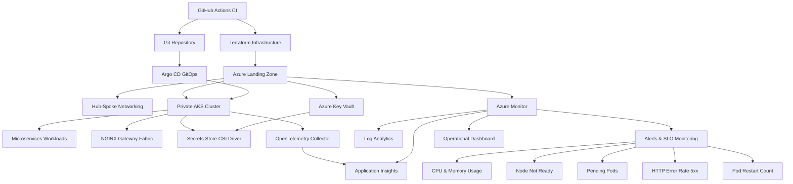

# Azure Cloud-Native DevOps-Plattform mit Zero Trust

> Praxisprojekt, in dem ich Azure-Cloud-Engineering übe — Infrastructure as Code (Terraform), GitOps, Kubernetes, Observability und Zero-Trust-Sicherheit.

---

## Überblick

Dieses Projekt zeigt, wie moderne Organisationen eine sichere, skalierbare, automatisierte und produktionsreife Cloud-Plattform in Microsoft Azure aufbauen können, unter Verwendung von:

- Terraform Infrastructure as Code
- Azure Kubernetes Service (AKS)
- GitOps-Delivery-Workflows
- Enterprise Landing Zone Governance
- Zero-Trust-Architektur
- Observability & SRE-Praktiken
- FinOps & Kostensteuerungsautomatisierung

Das Ziel dieses Projekts ist nicht nur die Infrastrukturbereitstellung — sondern die vollständige Plattformverantwortung über:

- Sicherheit
- Zuverlässigkeit
- Betrieb
- Governance
- Automatisierung
- Observability
- Kostenoptimierung

---

## Wichtigste Plattformfähigkeiten

### Enterprise Landing Zone & Governance

Eine strukturierte Azure Landing Zone-Architektur wurde implementiert mit:

- Management Groups
- RBAC-Governance
- Azure Policy-Durchsetzung
- Tagging-Standards
- Budgetkontrollen
- Umgebungsisolierung
- Richtliniengesteuerter Governance

---

### Zero-Trust-Sicherheitsarchitektur

Sicherheit wurde als grundlegendes Designprinzip implementiert mit:

- Microsoft Entra ID (Azure AD)
- MFA & Bedingter Zugriff
- Privileged Identity Management (PIM)
- Managed Identity-Authentifizierung
- Azure Key Vault
- Microsoft Defender for Cloud
- Private Endpoints
- Private AKS-Cluster

Alle Workloads werden über sichere private Netzwerke mit streng kontrolliertem Administratorzugriff betrieben.

---

### Cloud-Native Platform Engineering

Eine vollständig automatisierte Cloud-Native-Plattform wurde aufgebaut mit:

- Azure Kubernetes Service (AKS)
- Terraform-Modulen
- GitHub Actions CI-Pipelines
- Argo CD GitOps-Deployments
- Azure Container Registry (ACR)
- Kustomize-Overlays
- Secrets Store CSI Driver

Infrastruktur- und Anwendungsdeployments sind vollständig Git-gesteuert ohne manuelle Produktionsänderungen.

---

### Observability, Zuverlässigkeit & SRE

Zentralisierte Observability und operative Bereitschaft wurden implementiert mit:

- Azure Monitor
- Application Insights
- Log Analytics
- OpenTelemetry-Instrumentierung
- SLO-basiertem Monitoring & Alerting
- Kubernetes Health-Monitoring
- Operativen Dashboards
- Incident-Response-Workflows

#### Zuverlässigkeitsziele

- Lead Time for Change < 1 Tag
- MTTR < 30 Minuten
- 100% Terraform-verwaltete Infrastruktur
- Null kritische ungelöste Sicherheitsbefunde

---

### Kostensteuerung & FinOps

Kostenorientierte Engineering-Praktiken wurden integriert durch:

- Azure Budgets
- Automatisches Herunterfahren von Nicht-Produktionsumgebungen
- AKS-Knotenskalierungsoptimierung
- Richtlinienbasierte Governance-Kontrollen
- Tag-gesteuerte Kostenzuweisung

Dies reduziert unnötige Cloud-Ausgaben bei gleichzeitiger Aufrechterhaltung der betrieblichen Effizienz.

---

## Architekturüberblick

### Grundprinzipien

- Identitätsorientierte Sicherheit
- Standardmäßig privates Netzwerk
- Git als einzige Wahrheitsquelle
- Automatisierung statt manueller Betrieb
- Beobachtbare Systeme
- Least-Privilege-Zugriffsmodell
- Wiederholbare Infrastrukturdeployments

---

## Plattformarchitektur



---

## Technologie-Stack

### Cloud & Infrastruktur

- Microsoft Azure
- Terraform
- Azure Landing Zones
- Azure Policy
- Azure RBAC
- Azure Key Vault
- Azure Virtual Network (Hub-Spoke)

### Kubernetes & Platform Engineering

- Azure Kubernetes Service (AKS)
- Argo CD
- Helm
- Kustomize
- NGINX Gateway Fabric
- Secrets Store CSI Driver

### DevOps & Automatisierung

- GitHub Actions
- GitOps-Workflows
- Terraform Remote State
- Actions Runner Controller (ARC)

### Sicherheit

- Entra ID (Azure AD)
- MFA
- Bedingter Zugriff
- Privileged Identity Management (PIM)
- Managed Identity
- Private Endpoints

### Observability

- Azure Monitor
- Log Analytics
- Application Insights
- OpenTelemetry

---

## Deployment-Phasen

| Phase | Ziel | Ergebnisse |
|---|---|---|
| Phase 0 | Planung & Einrichtung | Terraform-Backend, Repository-Struktur, Umgebungen |
| Phase 1 | Governance-Fundament | Management Groups, RBAC, Richtlinien, PIM |
| Phase 2 | Kerninfrastruktur | VNets, ACR, Key Vault, Log Analytics |
| Phase 3 | AKS-Plattform | Privates AKS, Knotenpools, Workloads |
| Phase 4 | CI/CD & GitOps | GitHub Actions, Argo CD, Overlays |
| Phase 5 | Observability & Sicherheit | Monitoring, Alerts, Defender, Budgets |
| Phase 6 | Validierung & Betrieb | Dashboards, Runbooks, Incident-Simulationen |

---

## Terraform Remote State

### Phase 0 | Planung & Einrichtung

**Ressourcengruppe erstellen**

```bash
az group create \
  --name tfstate-rg \
  --location eastus2
```

**Speicherkonto erstellen**

```bash
az storage account create \
  --name 3tierstorageaccts \
  --resource-group tfstate-rg \
  --sku Standard_LRS \
  --kind StorageV2 \
  --https-only true \
  --allow-blob-public-access false
```

**State-Container erstellen**

```bash
az storage container create \
  --name tfstate \
  --account-name 3tierstorageaccts \
  --auth-mode login
```

**Ressourcengruppe löschen**

```bash
az group delete --name tfstate-rg --yes --no-wait
```

### Terraform-Module

**Phase 1 | Landing Zone**

```bash
cd envs/dev/phase1-foundation   # für dev
cd envs/prod/phase1-foundation  # für prod
```

**Phase 2 | Kerninfrastruktur**

```bash
cd envs/dev/phase2-platform   # für dev
cd envs/prod/phas2-platform   # für prod
```

**Phase 3 | AKS Workload**

```bash
cd envs/dev/phase3-workload  # für dev
cd envs/prd/phase3-workload  # für prod
```

---

## AKS-Zugriff

### Öffentlicher Cluster (Dev)

```bash
ssh azureuser@publicIP
```

### Privater Cluster (Prod)

Diese Plattform verwendet einen privaten AKS-Cluster mit kontrolliertem Administratorzugriff über Azure Bastion mit einer Jumpbox.

**Ressourcen-ID der VM abrufen**

```bash
az vm show -g platform-spoke-rg -n jumpbox --query id -o tsv
```

**Mit Bastion Host verbinden**

```bash
az network bastion ssh \
  --name bastion \
  --resource-group platform-hub-rg \
  --target-resource-id $(az vm show -g platform-spoke-rg -n jumpbox --query id -o tsv) \
  --auth-type ssh-key \
  --username azureuser \
  --ssh-key ~/.ssh/id_ed25519
```

---

## Managed Identity

**Mit Managed Identity anmelden**

```bash
az login --identity
```

**AKS-Anmeldeinformationen abrufen**

```bash
az aks get-credentials \
  -g platform-spoke-rg \
  -n 3tier-aks \
  --overwrite-existing
```

**kubectl konfigurieren**

```bash
kubelogin convert-kubeconfig -l azurecli
kubectl get nodes
```

**GitHub-Identität — Client-ID abrufen** (als `AZURE_CLIENT_ID` in GitHub-Secrets gespeichert)

```bash
az login

az identity show \
  --name github-identity \
  --resource-group platform-rg \
  --query clientId \
  -o tsv
```

**Federated Identity Credential verifizieren**

```bash
az identity federated-credential list \
  --identity-name github-identity \
  --resource-group platform-rg

az identity federated-credential list \
  --resource-group platform-rg \
  --identity-name workload-identity \
  -o json
```

**Workload Identity — Client-ID abrufen**

```bash
az identity show \
  --name workload-identity \
  --resource-group platform-rg \
  --query clientId \
  -o tsv
```

**Federated Identity Credentials für Workload Identity verifizieren**

```bash
az identity federated-credential list \
  --resource-group platform-rg \
  --identity-name workload-identity \
  -o table

az identity federated-credential show \
  --resource-group platform-rg \
  --identity-name workload-identity \
  --name workload-credential
```

---

## KeyVault-Secrets

```bash
az login --identity

export KEYVAULT_NAME="your-keyvault-name"
export DB_USER="todo_user"
export DB_PASSWORD=$(openssl rand -base64 16)
export DB_NAME="appdb"
export SECRET_KEY=$(openssl rand -base64 32)
export TENANT_ID=$(az account show --query tenantId -o tsv)
export DB_HOST="3tier-postgres-server.postgres.database.azure.com"

az keyvault secret set --vault-name $KEYVAULT_NAME --name db-user --value "$DB_USER"
az keyvault secret set --vault-name $KEYVAULT_NAME --name db-password --value "$DB_PASSWORD"
az keyvault secret set --vault-name $KEYVAULT_NAME --name db-name --value "$DB_NAME"
az keyvault secret set --vault-name $KEYVAULT_NAME --name db-host --value "$DB_HOST"
az keyvault secret set --vault-name $KEYVAULT_NAME --name secret-key --value "$SECRET_KEY"
```

---

## Phase 4 — GitOps

Die Plattform verwendet:

- GitHub Actions für CI-Pipelines
- Argo CD für GitOps Continuous Delivery
- Kustomize-Overlays für Umgebungstrennung
- Actions Runner Controller (ARC) für selbst gehostete Kubernetes-Runner

Infrastruktur- und Anwendungsdeployments sind vollständig Git-gesteuert.

---

### Schritt 1 — Actions Runner Controller installieren

```bash
kubectl create namespace arc-systems
kubectl create namespace arc-runners

helm install arc \
  --namespace arc-systems \
  --create-namespace \
  oci://ghcr.io/actions/actions-runner-controller-charts/gha-runner-scale-set-controller

kubectl get pods -n arc-systems

kubectl create secret generic github-secret \
  -n arc-runners \
  --from-literal=github_token=your-github-pat-token
```

**runner-values.yaml erstellen**

Konfiguriert selbst gehostete GitHub Actions Runner im AKS-Cluster.
Statt Cloud-Runner (kostenpflichtig) laufen die CI/CD-Pipelines direkt im Cluster —
mit Zugriff auf das private Netzwerk und automatischer Skalierung (min. 1, max. 2 Runner).

```bash
cat > runner-values.yaml <<EOF
githubConfigUrl: https://github.com/myfilesrepos/azure-cloud-platform
githubConfigSecret: github-secret
runnerScaleSetName: arc-runner-set
minRunners: 1
maxRunners: 2
template:
  spec:
    containers:
      - name: runner
        image: ghcr.io/actions/actions-runner:latest
        command: ["/home/runner/run.sh"]
        resources:
          requests:
            cpu: "500m"
            memory: "512Mi"
          limits:
            cpu: "1"
            memory: "1Gi"
EOF

helm install arc-runner-set \
  --namespace arc-runners \
  --create-namespace \
  -f runner-values.yaml \
  oci://ghcr.io/actions/actions-runner-controller-charts/gha-runner-scale-set

kubectl get pods -n arc-runners
kubectl get autoscalingrunnersets -n arc-runners
kubectl describe autoscalingrunnerset arc-runner-set -n arc-runners
kubectl logs -n arc-systems deployment/arc-gha-rs-controller
kubectl get autoscalingrunnersets -A
```

**Ressourcen bereinigen**

```bash
helm uninstall arc-runner-set -n arc-runners
helm uninstall arc -n arc-systems
kubectl delete namespace arc-runners
kubectl delete namespace arc-systems
kubectl delete secret github-secret -n arc-runners
```

---

### Schritt 2 — Tools installieren (CSI Driver, Cert Manager, NGINX Gateway Fabric)

**Cert Manager installieren**

```bash
helm install \
  cert-manager oci://quay.io/jetstack/charts/cert-manager \
  --version=1.20.2 \
  --namespace cert-manager \
  --create-namespace \
  --set crds.enabled=true \
  --set config.apiVersion="controller.config.cert-manager.io/v1alpha1" \
  --set config.kind="ControllerConfiguration" \
  --set config.enableGatewayAPI=true
```

**Secrets Store CSI Driver installieren**

```bash
helm repo add secrets-store-csi-driver https://kubernetes-sigs.github.io/secrets-store-csi-driver/charts

helm install csi-secrets-store \
  secrets-store-csi-driver/secrets-store-csi-driver \
  --namespace kube-system \
  --set enableSecretRotation=true \
  --set rotationPollInterval=10s \
  --set syncSecret.enabled=false

kubectl apply -f https://raw.githubusercontent.com/Azure/secrets-store-csi-driver-provider-azure/master/deployment/provider-azure-installer.yaml
```

**NGINX Gateway Fabric installieren**

```bash
kubectl kustomize "https://github.com/nginx/nginx-gateway-fabric/config/crd/gateway-api/standard?ref=v2.5.1" | kubectl apply -f -
helm install ngf oci://ghcr.io/nginx/charts/nginx-gateway-fabric --create-namespace -n nginx-gateway
kubectl wait --timeout=5m -n nginx-gateway deployment/ngf-nginx-gateway-fabric --for=condition=Available
kubectl get svc -n nginx-gateway

kubectl create secret generic cloudflare-api-token \
  --from-literal=api-token='YOUR_CLOUDFLARE_TOKEN' \
  -n cert-manager
```

---

### Schritt 3 — Argo CD installieren

```bash
kubectl create namespace argocd

kubectl apply -n argocd \
  --server-side \
  --force-conflicts \
  -f https://raw.githubusercontent.com/argoproj/argo-cd/stable/manifests/install.yaml

kubectl get pods -n argocd

kubectl patch svc argocd-server -n argocd \
  -p '{"spec": {"type": "LoadBalancer"}}'

kubectl get svc argocd-server -n argocd

kubectl port-forward svc/argocd-server -n argocd 8080:443

kubectl -n argocd get secret argocd-initial-admin-secret \
  -o jsonpath="{.data.password}" | base64 -d && echo

kubectl annotate svc argocd-server \
  -n argocd \
  service.beta.kubernetes.io/azure-load-balancer-internal="true"

kubectl get svc argocd-server -n argocd
```

---

### Schritt 4 — ArgoCD mit Umgebungs-Overlays deployen

```bash
git clone https://github.com/myfilesrepos/azure-cloud-platform.git
cd azure-cloud-platform
ls gitops/argocd

kubectl apply -f gitops/argocd/dev-application.yaml
kubectl apply -f gitops/argocd/prod-application.yaml
kubectl get pods -n todo-app
```

---

### Schritt 5 — DNS auflösen (Cloudflare)

```bash
nslookup cloudbasics.info
kubectl get gateway -n todo-app
kubectl get svc -A
```

---

## Sicherheitsmodell

Dieses Projekt folgt Zero-Trust-Prinzipien:

- Identitätsorientierte Authentifizierung
- MFA-Durchsetzung
- PIM-aktivierter privilegierter Zugriff
- Privates Netzwerk
- Keine öffentliche Infrastrukturexposition
- Richtliniengesteuerter Governance
- Managed Identities statt statischer Anmeldeinformationen

---

## Erfolgskennzahlen

- Lead Time for Change < 1 Tag
- MTTR < 30 Minuten
- 100% Terraform-verwaltete Infrastruktur
- Null kritische ungelöste Sicherheitsbefunde
- Reduzierte unnötige Cloud-Ausgaben in Nicht-Produktionsumgebungen

---

## Mehrwert

Dieses Projekt demonstriert:

- Enterprise-skalierte Azure-Architektur
- Sichere Cloud-Einführung mit Zero Trust
- Platform-Engineering-Reife
- GitOps & Infrastructure as Code Best Practices
- Cloud-Native Kubernetes-Operationen
- DevSecOps-Automatisierung
- Observability & SRE-gesteuerter Betrieb
- Kostenbewusste Cloud-Governance

---
